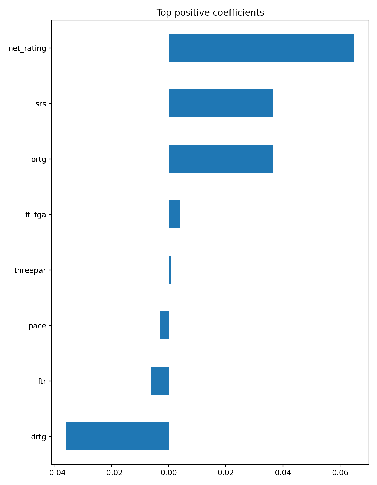

# NBA Win% Predictor

Predict NBA **team Win%** from advanced stats. This repo includes reproducible notebooks, a trained model, and a Streamlit demo.

## Highlights
- End-to-end pipeline: **combine → clean/EDA → model → demo app**
- Clear, explainable baseline (**Linear Regression**) with standardized features
- Saved artifacts for easy reuse (model, scaler, features, metrics)
- One-file **Streamlit** app for interactive predictions

## Results (20% holdout)
- **R²:** 0.937  
- **RMSE:** 0.036  
- **MAE:** 0.029  
- **Baseline RMSE:** 0.144  




---

## Quick start

### 1) Setup (Windows)
```bash
python -m venv .venv
.venv\Scripts\activate
pip install -r requirements.txt


## Project structure
nba-win-predictor/
├─ app/
│ └─ app.py
├─ data/
│ ├─ combined_team_stats.csv
│ └─ clean_team_stats.csv
├─ images/
│ ├─ top_positive_coeffs.png
│ ├─ top_negative_coeffs.png
│ └─ app_screenshot.png
├─ model/
│ ├─ win_predictor.pkl
│ ├─ scaler.pkl
│ ├─ features.csv
│ └─ metrics.json
├─ notebooks/
│ ├─ 01_combine.ipynb
│ ├─ 02_clean_eda.ipynb
│ └─ 03_modeling.ipynb
├─ requirements.txt
├─ .gitignore
└─ README.md

## Method 

- **Features:** `pace`, `ortg`, `drtg`, `net_rating`, `srs`, `threepar`, `ftr`, `ft_fga`, etc.  
- **Preprocessing:** numeric coercion, median imputation, light outlier trimming, then **StandardScaler**.  
- **Model:** **Linear Regression** (explainable baseline).  
- **Evaluation:** R² / RMSE / MAE on a **20% holdout** split.  
- **Interpretability:** coefficient bar charts for top positive/negative drivers.


## Artifacts

- `model/win_predictor.pkl` — trained regression model  
- `model/scaler.pkl` — StandardScaler fitted on training data  
- `model/features.csv` — exact feature order expected by the model  
- `model/metrics.json` — saved metrics (R², RMSE, MAE, baseline RMSE)


## Data

**Source:** Basketball-Reference league pages  
**URL:** https://www.basketball-reference.com/leagues/

**How to export (per season):**
1. Open a season page (e.g., https://www.basketball-reference.com/leagues/NBA_2015.html).
2. Scroll to the **Advanced (Misc) Team Stats** table.
3. Click **Share & Export → Get table as CSV**.
4. Save into your repo’s `data/` folder as **`nba_misc_YYYY.csv`** (e.g., `nba_misc_2015.csv`).

**Used in this project:** seasons 2014–2024 (you can add more by repeating the steps).


